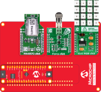

# ANxxxx - How to use Force Sensitive Resistor with 12-bit ADC

This application note describes how to use the ADC on tinyAVR® 2 Family microcontrollers to measure a Force Sensitive Resistor. The ADC supports sampling in bursts where a configurable number of conversion results are accumulated into a single ADC result (sample accumulation). This feature is used in the example application to accumulate 1024 samples and perform averaging.

In the example application, the ADC result will be sent to an android/iOS app over Bluetooth communication using the RN4870 Click board. 
The ADC result will also be sent to a serial terminal and a 4x4 RGB Click board is used to illuminate different LEDs corresponding to the applied force on the force sensor on the Force Click board.

## Related Documentation
The application note explaining the concepts used in this repository can be found at https://microchip.com/DS00003408

## Setup

In the example application, the ADC result will be sent to an android/iOS app over Bluetooth communication using the RN4870 Click board. The ADC result will also be sent to a serial terminal and a 4x4 RGB Click board is used to illuminate different LEDs corresponding to the applied force on the force sensor on the Force Click board.

- Connect the ATtiny1627 Curiosity Nano on Curiosity Nano Adapter Board
- Connect RN4870 Click on the Slot1 on Curiosity nano Adapter Board
- Connect Force Click  on the Slot2 on Curiosity nano Adapter Board
- Connect 4x4 RGB Click on the Slot3 on Curiosity nano Adapter Board

# Operation

- Connect the ATtiny1627 Curiosity Nano to a computer using a USB cable
- Download the application and program it to the ATtiny1627 Curiosity Nano
- Refer to topic 'Demo Operation' in Application Note

## Conclusion

This example has shown how to measure a force sensitive resistor using the ADC on a tinyAVR 2 Family microcontroller.